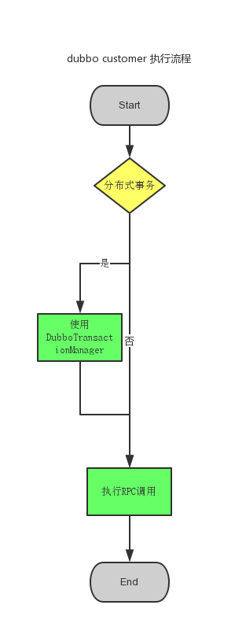
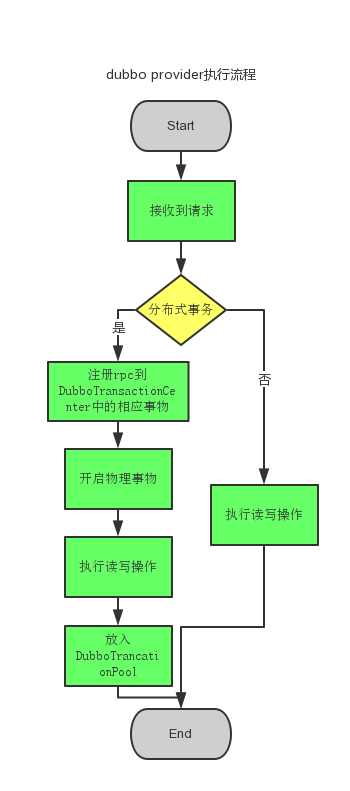
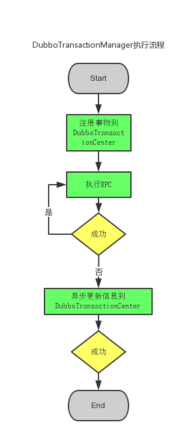
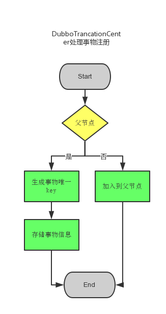
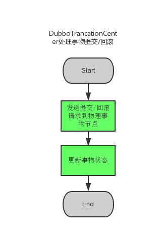
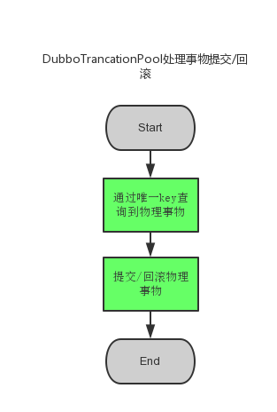

## dubbo分布式事物技术方案

### 系统主要角色

* customer

```

dubbo服务的消费者,多个customer使用 DubboTransactionManager 实现分布式事物

```

* provider

```

dubbo服务的提供者，根据customer传递的信息确实是否使用 分布式事物

```

* DubboTransactionManager

```

dubbo分布式事物管理器(新实现)，customer使用它实现分布式事物

```

* DubboTransactionCent
er

```

dubbo分布式事物中心(新实现)，管理并协调各个 DubboTransactionPool

```

* DubboTransactionPool

```

dubbo本地事物池(新实现)，分布在各个dubbo server，管理本地事物。
提供 事物提交/回滚服务 给 DubboTransactionCent
er

```

### 实现原理及细节


* customer执行分布式事物



```

需要使用 分布式事物 的一组rpc使用DubboTransactionManager；普通的rpc使用方式不变。可实现原有系统平滑过度，对开发友好。

```

* provider执行分布式事物



```

需要提供 分布式事物 支持的provider必须提供 Boolean txFlag,String txId,默认为方法最后二个参数，txFlag默认值为false。

```

* DubboTransactionManager执行原理


  
```
开启事物时，请求DubboTransactionCenter注册事物。执行完毕，请求DubboTransactionCenter提交/回滚事物。

```

* DubboTransactionCenter处理事物注册



```

默认存储到内存中，如果考虑事物治理，可以定期dump到DB。

```

* DubboTransactionCenter处理事物提交/回滚



```

考虑到服务调用方需要通过事物的提交/回滚 是否成功 来确定 最终结果，各个物理节点的 提交/回滚 操作可以并行执行，但需要等待所有节点都应答后，才返回给 服务调用方 执行结果。

```

* DubboTransactionPool处理本地事物



```

每台提供服务的节点都运行DubboTransactionPool，并发布 txHandle 服务给 DubboTransactionCenter 调用

```

### 技术细节

```

需要权衡物理事物的超时时间。DubboTransactionCenter与DubboTransactionPool交互的时候会存在网络开销，所以应该控制分布式事物中的物理事物节点数量。

```

### 面临挑战

```

使用分布式事物可能会带来较长时间的锁表，甚至锁库。

```

优点

* 业务方开发效率高
* 耦合度相对较低
* 数据强一致性，无需考虑因 最终一致性 带来的用户体验问题
* 优化空间大，如后续从协议层面解决问题，可长期演进

缺点

* 比较难确保高qps
* 对数据库性能有较大影响