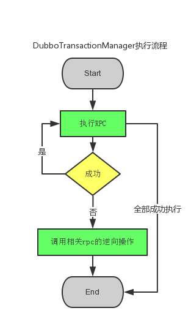

## 伪分布式事物

```

每个涉及 分布式事物 的服务提供相应的逆向操作。DubboTransactionManager在调用链条出现异常时，调用之前服务的逆向操作

```

### DubboTransactionManager工作原理




优点

* 可以提升qps,实现高吞吐量

* 业务方开发效率相对较高

* 可保证最终一致性

缺点

* 需要开发一些配套的逆向操作逻辑

* 需要处理用户体验的问题，如用户帐户资金的变动。
